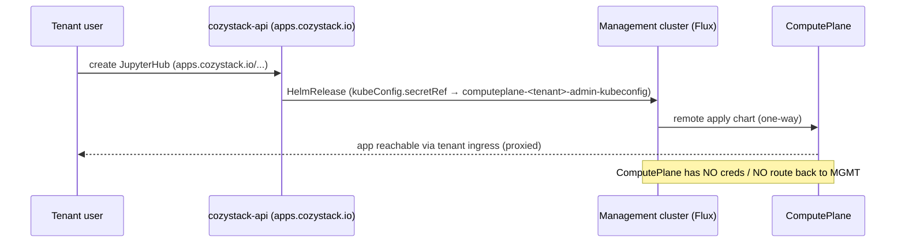

# cozyllm ComputePlane: technical design

- **Title:** `cozyllm ComputePlane: isolating code-executing apps on a hidden cluster`
- **Author(s):** `@kvaps`
- **Date:** `2026-06-23`
- **Status:** Draft
- **Tracking issue:** aenix-org/cozyllm#6 — *Isolate arbitrary-code-execution apps onto a separate, user-invisible cluster*
- **Upstream design:** cozystack/community#17

## Overview

`cozyllm` is a catalog of AI applications packaged as Cozystack external apps. Several of them run arbitrary user code as a core feature. Deploying those onto a shared infra/management cluster co-locates user-controlled code execution with the management plane — exactly the boundary Cozystack otherwise refuses to cross. This document specifies, for cozyllm concretely, how the code-executing apps are routed onto a **ComputePlane** (a hidden, Cozystack-managed Kubernetes cluster the tenant does not see or manage), which apps route there versus stay local, and the concrete wiring/changes inside cozyllm.

The ComputePlane itself — its provisioning, the Tenant-module wiring, and the remote-apply routing — is a generic Cozystack-core primitive specified in the upstream community proposal. (The name parallels "control plane": the management cluster is the control plane; the ComputePlane is the separate, Cozystack-managed cluster where untrusted workloads run, invisible to the tenant.) This document depends on that primitive and does not re-specify it; it describes only the cozyllm-side consumption.

## Why (cozyllm-specific)

Container isolation is not a multi-tenancy boundary. For a single-purpose managed service (Postgres, a vector DB) that is fine — the service *is* the barrier; the tenant cannot run arbitrary binaries inside it. For an app whose feature is "run the user's code" (a notebook, a workflow code-node, a custom Python plugin), the barrier is gone: a container-escape CVE becomes host root, host root becomes management-API access, management-API access leaks every tenant's keys. cozyllm must therefore split its catalog by whether an app executes user code, and route the code-executing half off the management cluster.

## App classification

| App | Executes arbitrary user code? | Mechanism | Placement |
|-----|-------------------------------|-----------|-----------|
| JupyterHub | Yes — by design | Notebooks run arbitrary Python/shell as the user | **ComputePlane** |
| n8n | Yes | Code nodes / Execute-Command nodes / community nodes | **ComputePlane** |
| ComfyUI | Yes | Custom nodes are arbitrary Python loaded in-process | **ComputePlane** |
| Langflow | Likely | Custom components / Python execution inside flows | **ComputePlane** |
| Open WebUI | Partly | Tools / pipelines / code-execution features | **ComputePlane** |
| vLLM | No | Inference serving only | Local (tenant namespace) |
| LiteLLM | No | API gateway / routing only | Local (tenant namespace) |

The usual reassurance — "these are just upstream charts that deploy into the tenant and rely on the same isolation" — holds **only for vLLM/LiteLLM**. For the rest, the workload's entire purpose is to run user-supplied code, so they must declare `placement: ComputePlane` and route to the ComputePlane.

> Note: Open WebUI's classification is "partly" because its code-execution surfaces (tools/pipelines) are optional; if a cozyllm-shipped build disables them, it could be reclassified as local. The conservative default is to route it to the ComputePlane. The same arbitrary-code property applies to potential future catalog items (e.g. WordPress with plugins), which is why the routing is a generic primitive rather than a per-app hack.

## How it wires in Cozystack

The ComputePlane reuses primitives that already exist in Cozystack (no net-new isolation machinery is invented by cozyllm):

- **ComputePlane substrate** — the managed `kubernetes` app: Kamaji-hosted control plane + CAPI/KubeVirt worker nodes, with GPU node groups and cluster-autoscaler. The ComputePlane is provisioned and owned by Cozystack but is *not* surfaced to the tenant as a `Kubernetes` resource.
- **Remote Flux apply** — Flux `HelmRelease.spec.kubeConfig.secretRef`. This is already how the `kubernetes` app installs its own in-cluster addons; the kubeconfig Secret is `<cluster-name>-admin-kubeconfig`, key `super-admin.svc`, written by Kamaji.
- **Tenant module** — the ComputePlane is delivered as a Tenant module (the same mechanism as `etcd`/`monitoring`/`ingress`/`seaweedfs`): a single string field `computePlane: "<profile>"` (empty = disabled) on the Tenant, set by the parent tenant. The profile (node groups, GPU types, version, autoscaling bounds) is defined once at the tenant/platform level and referenced by name — no inline override blob.
- **Default-deny network posture** — per-tenant `CiliumNetworkPolicy` and the `policy.cozystack.io/allow-to-apiserver` opt-in label gate access to the management API.

### Deployment flow



1. The tenant creates e.g. a `JupyterHub` from the dashboard — unchanged UX.
2. `cozystack-api` converts it to a `HelmRelease` on the management cluster. Because the app's `ApplicationDefinition` declares `placement: ComputePlane`, the generated `HelmRelease` carries `spec.kubeConfig.secretRef` → the tenant's `computeplane-<tenant>-admin-kubeconfig`.
3. Flux on the management cluster applies the chart **into the ComputePlane** — never into the tenant namespace on the management cluster.
4. The app exposes itself via Ingress on the ComputePlane, wired back to the tenant's normal entry point. The user reaches it at a normal hostname; they never get a kubeconfig.

vLLM/LiteLLM skip step 2's kubeConfig injection entirely: their `ApplicationDefinition` is `placement: ManagementPlane` (the default), so they deploy locally as today.

## Concrete changes in cozyllm

cozyllm is a catalog of external apps; the changes are mostly metadata + a placement value, not new controllers.

1. **Set `placement: ComputePlane` on code-executing apps.** In each code-executing app's `ApplicationDefinition`, set `spec.application.placement: ComputePlane` (the enum and field are owned by the core proposal; default is `ManagementPlane`). Apps: `jupyterhub`, `n8n`, `comfyui`, `langflow`, `open-webui`. Leave `vllm-inference` and `litellm` at the default `placement: ManagementPlane`.

   ```yaml
   # cozyllm app ApplicationDefinition (illustrative)
   apiVersion: cozystack.io/v1alpha1
   kind: ApplicationDefinition
   metadata:
     name: jupyterhub
   spec:
     application:
       kind: JupyterHub
       plural: jupyterhubs
       singular: jupyterhub
       placement: ComputePlane    # <-- routes to the ComputePlane; default is "ManagementPlane"
       openAPISchema: "{...}"
     release:
       chartRef:
         kind: HelmChart
         name: cozyllm-jupyterhub
       prefix: "jupyterhub-"
   ```

2. **Do not embed remote-apply logic in the app charts.** The `kubeConfig.secretRef` injection is performed centrally by the core app→HelmRelease conversion when `placement == ComputePlane`. cozyllm charts stay unaware of where they land — this keeps every app chart identical whether it runs locally or on a ComputePlane, and avoids duplicating the routing decision per app.

3. **Declare the ComputePlane module dependency.** cozyllm's install/bundle documents that a tenant intended to host code-executing apps must have the ComputePlane Tenant module set (a non-empty `computePlane` profile name). If a `placement: ComputePlane` app is created in a tenant chain with no ComputePlane, creation is rejected (fail closed) rather than silently deploying onto the management cluster.

4. **Ingress/access wiring.** Code-executing apps expose themselves via standard Ingress/Gateway on the ComputePlane; cozyllm relies on the core ComputePlane module to wire that back to the tenant entry point. No app-specific proxy code in cozyllm.

5. **GPU node groups.** cozyllm's GPU-consuming apps (ComfyUI, JupyterHub with GPU notebooks, vLLM if/when co-located differently) rely on the ComputePlane's `nodeGroups[*].gpus` + autoscaling. The node-group sizing/GPU defaults live in the ComputePlane **profile** (defined once at the tenant/platform level); cozyllm may recommend a profile but does not own the node-group schema and carries no per-app override blob.

## What stays local (and why it's safe)

vLLM and LiteLLM are inference/serving and API-gateway components: they accept prompts and return tokens, they do not execute user-supplied code. They remain in the tenant namespace on the management cluster, deployed exactly as today (`placement: ManagementPlane`, the default), with no ComputePlane dependency. Keeping them local also keeps the latency-sensitive inference path off the extra cross-cluster hop and lets LiteLLM act as the metering/quota point (token accounting) for billing work that is tracked separately.

## Security guarantees (cozyllm view)

These mirror the core proposal's guarantees, asserted specifically for cozyllm's apps:

- A JupyterHub notebook (or n8n code node, ComfyUI custom node, Langflow component) runs on the ComputePlane with **no token/kubeconfig for** and **no network route to** the management/infra kube-apiserver.
- Untrusted code runs on KubeVirt-VM worker nodes, so a container escape is confined to a disposable VM and a workload-induced kernel panic takes out a VM, not a shared physical node.
- The ComputePlane has its own Kamaji control plane and RBAC — a separate identity domain from the management cluster.
- vLLM/LiteLLM, being code-execution-free, remain safely co-located, and the security posture for them is unchanged.
- No new tenant-supplied input reaches the management plane: tenants still only write `apps.cozystack.io/*`; placement routing is decided by cozyllm-owned `ApplicationDefinition` metadata.

This closes the latent gap described in aenix-org/cozyllm#6 — it is a pre-productization hardening, not a response to a known exploit.

## Phasing (cozyllm)

- **Interim (before the ComputePlane exists):** gate the code-executing apps out of shared infra/prod. Only vLLM/LiteLLM are safe to co-locate. JupyterHub/n8n/ComfyUI/Langflow/Open WebUI are dev/single-tenant only until the ComputePlane ships.
- **Phase 1:** once the core ComputePlane primitive lands, set `placement: ComputePlane` on the five code-executing apps and require the ComputePlane module for tenants hosting them.
- **Phase 2:** revisit Open WebUI's classification (route local if code-exec surfaces are disabled in the shipped build); fold in billing/metering via LiteLLM token metrics (tracked separately).

## Open questions (cozyllm)

- The `placement` enum and field are owned by the core proposal (`ManagementPlane` | `ComputePlane`, default `ManagementPlane`) — cozyllm follows whatever the core proposal lands.
- One ComputePlane per tenant for the whole cozyllm bundle, or finer-grained? Default: one per enabling tenant, shared by that tenant's code-executing apps.
- Managed-service credential propagation: if a cozyllm app on the ComputePlane needs a managed Postgres created in the tenant, how does the connection secret reach it? Out of scope here; depends on the core credential-propagation work.
- Billing: metering ComputePlane resource and per-tenant API/token consumption (LiteLLM metrics) — adjacent product work.

## References

- Tracking issue: aenix-org/cozyllm#6
- Upstream generic design: cozystack/community#17
